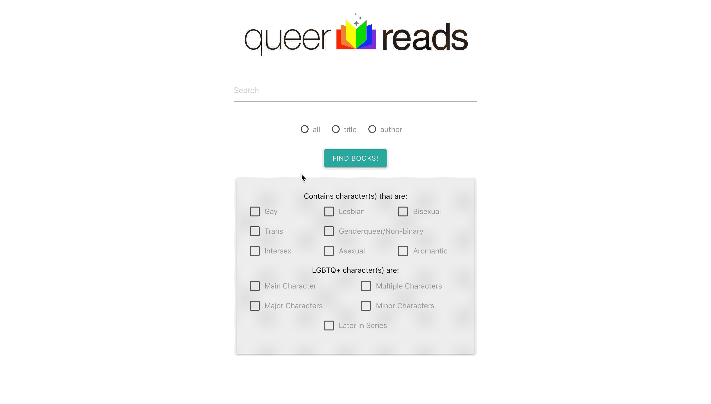

# Queer Reads
> A passion solo project that features a user friendly searchable interface to find novels accumulated by the community of /r/fantasy on Reddit.

This project is all thanks to the Reddit user KristaDBall and the /r/fantasy Reddit community. Together, they put together a spreadsheet of information on LGBTQ+ related books. I found the spreadsheet hard to use, so I decided to make it easier to access by turning it into an application. You can find the original project [here.](https://docs.google.com/spreadsheets/d/1roLOB8OZm34XjzVyDmH5fyWiPKGYy8i9EzRuhBMZauo/)

Queer Reads lets you search through a database of books using either the searchbar, the checkboxes avaliable, or both! It also gives you information on the items with data from GoodReads

## Installation

> 1. Clone repo
>    - `git clone https://github.com/rpan06/queer-reads.git`
> 1. Change directory into the newly cloned repo
>    - `cd queer-reads`
> 1. Install dependencies
>    - `npm install`
> 1. Create a MySQL database and fill with data from:
>    - `data.sql`
> 1. Configure with your database info
>    - `cp config.default.js config.js`
> 1. Start server
>    - `npm run dev`
> 1. Open a browser and navigate to `localhost:9000`

## Author

Rachel Pan - rpan06@gmail.com

[https://github.com/rpan06](https://github.com/rpan06/)
